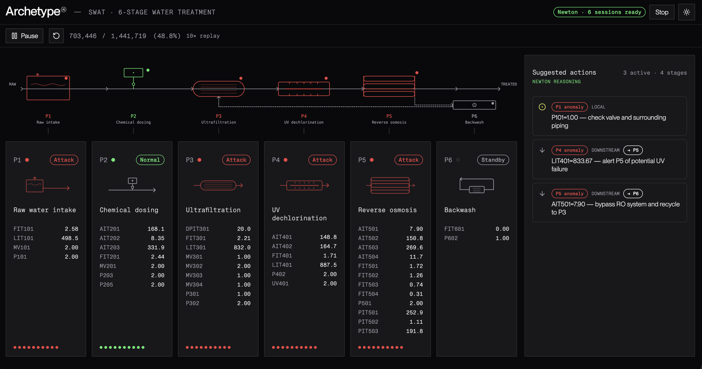

# newton-swat-demo



Feasibility demo: a water treatment plant paved with sensors, using Newton Machine State Lens to detect per-stage anomalies in real time and surface suggested upstream/downstream actions to an operator.

## Concept

Six process stages in sequence:

1. **P1** — Raw water intake and storage
2. **P2** — Chemical dosing (pre-treatment)
3. **P3** — Ultrafiltration (UF)
4. **P4** — UV dechlorination
5. **P5** — Reverse osmosis (RO)
6. **P6** — Backwash / cleaning

One Newton Machine State Lens session per stage, each trained on that stage's own sensors (n-shot normal vs attack). When a stage flags anomalous, the UI surfaces suggested actions on the adjacent stages ("reduce flow from P2", "isolate P4") — framed as suggestions for a human operator, not autonomous control.

## Stack

Svelte 5 + SvelteKit · Tailwind v4 · `@archetypeai/ds-lib-tokens` · bits-ui · layerchart.

## Data

### Attribution

The SWaT (Secure Water Treatment) dataset was created by [iTrust, Centre for Research in Cyber Security](https://itrust.sutd.edu.sg/) at the Singapore University of Technology and Design (SUTD). For published work, request the dataset through [iTrust's official channels](https://itrust.sutd.edu.sg/itrust-labs_datasets/).

11 consecutive days of 1-second readings from a scaled-down but fully operational six-stage water treatment plant — 7 days of normal operation followed by 4 days with 36 cyber-physical attack scenarios.

### Download (Kaggle mirror)

The fastest way to get started is the [Kaggle mirror of SWaT](https://www.kaggle.com/datasets/vishala28/swat-dataset-secure-water-treatment-system). Download the normal and attack CSVs and drop them in `data/`.

### Prep

The repo tracks the pre-processed outputs in `data/` via Git LFS:

- `swat_raw_labeled.csv` — full labeled timeline used for streaming replay
- `swat_normal.csv` / `swat_attack.csv` — n-shot training examples (normal vs attack)
- `swat_quick_test_200.csv` — 200-row smoke test
- `swat_inference.csv` — inference subset

If you want to regenerate these from a fresh Kaggle download, see `scripts/` — those scripts are ported verbatim from [`archetypeai/archetypeai-batch-examples-swat`](https://github.com/archetypeai/archetypeai-batch-examples-swat) and forward-fill missing SCADA readings before labeling and splitting.

## Setup

```bash
cp .env.example .env
# edit .env with your ATAI_API_KEY and ATAI_API_ENDPOINT

npm install
npm run dev
```

Open http://localhost:5173, press **Start analysis** to spin up the 6 per-stage Newton sessions (n-shot upload + lens register), then **Play** to replay the SWaT timeline at 10× real time and watch classifications arrive on each stage.

## How the demo interacts with Newton

Three phases: **setup**, **stream**, **classify**. Server-side logic lives in `src/lib/server/newton.js`; client-side fetch wrappers in `src/lib/api/swat.js`.

### Phase 1 — Setup (you click _Start analysis_)

```
Browser                    SvelteKit server               Newton API
   │                              │                           │
   │  EventSource                 │                           │
   │  GET /api/session ───────────▶                           │
   │                              │  cleanStaleLenses()       │
   │                              ├──── GET  /lens/metadata ──▶
   │                              │◀──────── list ────────────┤
   │                              ├──── POST /lens/delete ──▶
   │                              │                           │
   │                              │  uploadFile(swat_normal)  │
   │                              ├──── POST /files ─────────▶
   │                              ├──── POST /files (attack)─▶
   │                              │                           │
   │                              │  Promise.all(6 stages):   │
   │                              ├── POST /lens/register ───▶
   │                              ├── POST /lens/sessions/    │
   │                              │        create             │
   │                              ├── poll session.status     │
   │◀── data: {type:'step', ...}──┤                           │
   │◀── data: {type:'done',       │                           │
   │           sessions:[...]}    │                           │
```

Each of the six `POST /lens/register` calls is identical **except for `data_columns`** — the per-stage filter. P1's lens sees only `FIT101/LIT101/MV101/P101`; P5's lens sees its 12 columns. Shared n-shot `file_id`s, different column subsets → six independent classifiers trained on the same 2-class normal/attack problem but for different sub-systems. See `createStageSession()` in `src/lib/server/newton.js`.

### Phase 2 — Stream (every 30 rows while you _Play_)

```
Browser (+page.svelte tick loop)      SvelteKit /api/stream    Newton API
   │                                        │                       │
   │  every STEP_SIZE rows (30):            │                       │
   │  POST /api/stream {sessions, rows}     │                       │
   │  ───────────────────────────────────▶ │                       │
   │                                        │  Promise.allSettled:  │
   │                                        ├── streamWindowToStage('P1')─┐
   │                                        ├── streamWindowToStage('P2')─┤
   │                                        ├── ... P3, P4, P5, P6  ─────┤
   │                                        │                       │   │
   │                                        │  each fans out:       │   │
   │                                        │  - transpose window   │   │
   │                                        │    to channel-first   │   │
   │                                        │    [[col1 vals], ...] │   │
   │                                        │  - POST /lens/sessions│   │
   │                                        │    /events/process ──▶│◀──┘
   │◀── { ok:true, count:6 } ───────────────┤                       │
```

The channel-first transpose in `streamWindowToStage` is load-bearing — it's the shape Newton expects. Each stage's window goes to **its own session** over **its own columns**; the six streams are fully independent from Newton's point of view.

### Phase 3 — Classify (6 SSE streams back to the browser)

Each session created in phase 1 has its own SSE URL. The browser opens six `EventSource` connections simultaneously, one per stage, through an auth-proxy:

```
Browser                  /api/sse-proxy             Newton SSE
   │                           │                         │
   │  EventSource ×6           │                         │
   │  (one per stage)          │                         │
   │  ─────────────────────────▶                         │
   │                           ├── fetch with Bearer ───▶│
   │                           │◀── streaming body ──────┤
   │◀── data: {type:           │                         │
   │      'inference.result',  │                         │
   │      response:'ATTACK'}   │                         │
```

Each event is parsed by `parseSSELabel()` in `+page.svelte`. The client bucket-sorts results by which EventSource they arrived on → updates `stageStatuses[stageId]` → Svelte propagates that into the card's colored pill, the plant banner's colored dot, and the Suggested Actions rule engine.

### Phase 4 — Reason (Suggested Actions via Newton `/query`)

Whenever the set of anomalous stages changes, the browser calls Newton's `/query` endpoint directly with a structured plant-state snapshot and gets back JSON cards routed to the correct upstream/local/downstream neighbor. The full prompt, request body, response parsing, and reuse notes are in [`docs/suggested-actions-prompt.md`](docs/suggested-actions-prompt.md) — copy it as a template for similar "reason over structured state" flows in other apps.

### Inside one lens config

Simplified `/lens/register` body that we send per stage:

```js
{
  lens_name: 'swat-stage-lens-P3-1745337621',
  model_pipeline: [{ processor_name: 'lens_timeseries_state_processor' }],
  model_parameters: {
    model_name: 'OmegaEncoder',
    model_version: 'OmegaEncoder::omega_embeddings_01',
    buffer_size: 30,
    input_n_shot: {
      NORMAL: '<swat_normal.csv file_id>',
      ATTACK: '<swat_attack.csv file_id>'
    },
    csv_configs: {
      data_columns: ['DPIT301','FIT301','LIT301','MV301',
                     'MV302','MV303','MV304','P301','P302'],
      window_size: 30, step_size: 30
    },
    knn_configs: { n_neighbors: 3, metric: 'euclidean', ... }
  }
}
```

Newton's classifier inside the lens is:

1. **Omega encoder** — turn each 30-second sensor window into a dense embedding
2. **KNN** (k=3, Euclidean) — find the 3 closest embeddings among the n-shot examples
3. **Majority vote** → `NORMAL` or `ATTACK`
4. Result pushed out on the session's SSE stream

### Why 6 parallel sessions, not 1 shared

A single-session approach would feed Newton all 40 sensors at once and produce a plant-wide verdict. That's simpler but loses the *which stage* information — the whole point of the demo. With 6 per-stage sessions, when P1 fires `ATTACK` and P4 also fires `ATTACK` but P2/P3/P5/P6 stay `NORMAL`, we can route suggested actions specifically to each anomalous stage's upstream/downstream neighbors. That's the cascade-prevention story.

Cost: 6× the session-creation time at startup (mitigated by parallel `Promise.all`) and 6× the outbound requests per window (cheap — same dollar cost as 1 session on most Newton pricing since billing is usually by inference count, not session count).

## Scope caveats

- Anomaly labels in SWaT are plant-wide, not per-stage. Each per-stage Newton session is a best-effort inference based on *that stage's own sensors* — we're explicitly *not* looking at labels to decide which stage saw the attack.
- The Suggested Actions panel is strictly Reason-layer: it surfaces operator guidance, never takes control actions. For any real deployment, actuation would require a separate safety-reviewed control path.
